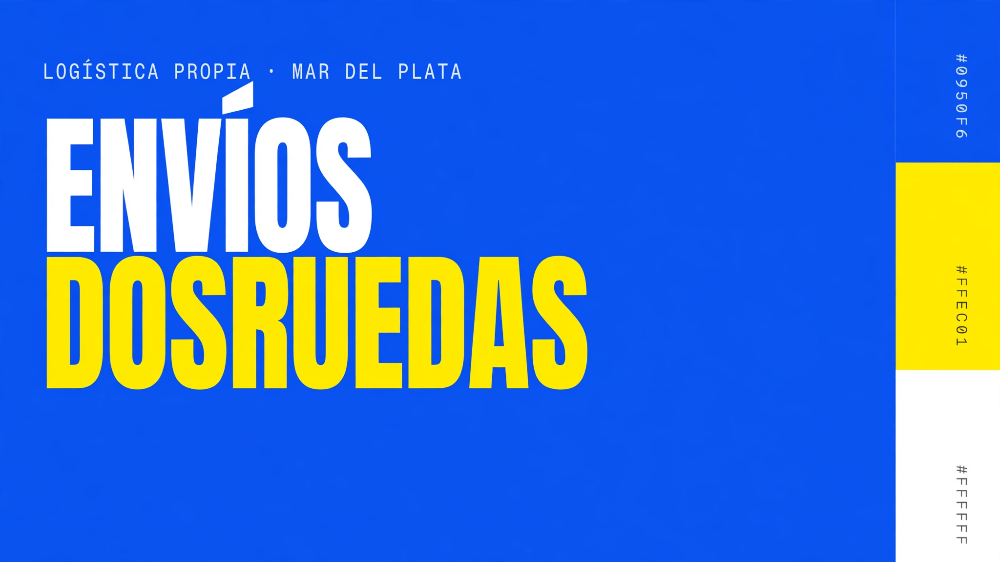

# Envíos DosRuedas — Design System

Sistema de diseño de **Envíos DosRuedas**, empresa de mensajería en moto y logística e-commerce de Mar del Plata, Argentina (base central: Friuli 1972 · +54 223 660-2699 · enviosdosruedas.com). Servicios: Envíos Express (franja de 3 hs), Envíos LowCost, Mercado Envíos Flex, Depósito/Fulfillment (E-commerce 24HS y Same Day), Cuenta Corriente para empresas, Plan Emprendedores (DropOFF), Contrareembolso.

## Fuentes

- Codebase local `locales_reformados/` (adjunto de solo lectura): 12 páginas HTML estáticas exportadas con Tailwind v4.3.3 (CSS inline), `assets/` (logo, heroes, cards, iconos sociales, fotos) y `DESIGN-AUDIT.md` (auditoría previa). Copia de referencia en `source/` — **no modificada**.
- Reglas v2 dadas por el usuario (azul máximo #0950F6, texto sobre amarillo = azul-500, botón único, etc.). Ver `DESIGN.md`.

Un solo producto/superficie: el **sitio web de marketing** (home, servicios, nosotros, contacto).

## Content fundamentals

- **Idioma:** español rioplatense con voseo: "Cotizá tu envío", "Escribinos", "Contanos qué necesitás mover", "Pedís antes de las 13:00 hs". Siempre tuteo directo (vos), nunca usted. Marca en primera persona plural: "Atendemos", "Llegamos a toda la ciudad".
- **Tono:** directo, concreto, callejero-profesional. Argentinismos moderados: "al toque", "no te dejan tirado", "MDQ". Sin jerga corporativa.
- **Datos duros como argumento:** horarios, cortes, direcciones y teléfonos aparecen siempre en Geist Mono con `tabular-nums` ("Corte 15:00 hs", "Friuli 1972 · Mar del Plata", "223 660-2699").
- **Casing:** titulares y labels en MAYÚSCULAS (via `text-transform`, no en el copy). Párrafos en sentence case. Nombres de servicio en Title Case ("Envíos Express", "Envíos Flex (MeLi)").
- **Headline con palabra resaltada:** h1 Anton con una frase en píldora amarilla rotada -1° ("Escribinos **te respondemos**").
- **Emoji:** no se usan en la UI. Aparece uno solo dentro de una reseña de cliente citada textualmente.
- **Microcopy de estado verificado:** "Abriendo WhatsApp…", "¡Listo! Te esperamos en WhatsApp.", "Por favor, ingresá tu nombre para iniciar el contacto.", "Teléfono copiado al portapapeles", "Saltar al contenido".
- **CTA:** verbo en imperativo voseo + objeto: "Cotizá tu envío", "Escribinos por WhatsApp", "Completá el formulario", "Ver servicios".

## Visual foundations

- **Paleta:** azul eléctrico #0950F6 + amarillo #FFEC01 + blanco. El azul-500 es el **máximo**: no existe azul más oscuro (600–900 eliminados; antes el 900 #041F63 era el color de texto). Rampa clara 50–300 para fondos/bordes; 400 solo decorativo. Texto sobre amarillo siempre azul-500 (4.94:1). Amarillo solo sobre azul (sobre blanco da 1.22:1).
- **Tipografía:** Anton (display, h1/h2, mayúsculas, tracking -0.03em, leading .92) · Bebas Neue (subheading: nav, botones, labels, badges, tracking .05em) · Outfit (cuerpo, 16/14px, leading 1.625, light 300 en leads) · Geist Mono (datos). Anton y Bebas solo existen en 400; los HTML aplican `font-bold` 538 veces sobre ellas = negrita sintética. El sistema nunca usa bold en display/subheading.
- **Fondos:** heroes solo azul-500 o amarillo-500, llenos de borde a borde. Textura: grilla punteada de 48px al 7% de opacidad, "blobs" radiales con blur 80–100px (amarillo 16%, azul 35–40%), anillos SVG con `animate-ping`. Secciones alternan blanco / azul-50 / azul-500. Fotos: renders 3D azul/amarillo (pin sobre mapa, moto, celular), fondos de tarjeta con trazos de luz amarilla sobre azul profundo, fotos de riders. Sin degradados multicolor ni morados (el #833AB4 es solo marca Instagram).
- **Tarjetas:** "double bezel": marco azul-50 al 80% con borde azul-100, radio 24px, padding 8px y sombra `float`; panel interior blanco (o azul-500) radio 16px con `shadow-inner`. Hover: borde azul-300, sombra `antigravity-deep`, -4px. Glass sobre azul: white/8% + borde white/15% + blur 12px.
- **Radios:** botones, badges y píldoras siempre `rounded-full`; controles e inputs 16px; tarjetas 24px (interior 16px); media 16px.
- **Sombras:** siempre azul de marca con alpha (xs→2xl, elevated, float, antigravity-deep). Amarillas solo en CTA (`accent-sm`, `cta-glow`). Brutalista `3px 3px 0 #0950F6` (antes valor arbitrario ×19).
- **Movimiento:** easing spring `cubic-bezier(.25,1,.5,1)` para CTA (.25s), bezel (.3s) y carrusel (.6s); default `.4,0,.2,1` .15s. Loops: pulse 2s, ping 1s, float-slow 6s, marquee 36/42s lineal. `prefers-reduced-motion` apaga los loops. Wordmark con "kinetic stretch" (scaleX 1.08 al hover).
- **Hover:** CTA primario → amarillo-400 + glow + icono circular se rellena de azul y se desplaza 4px. Links → amarillo + translateX 4px. Nav → fondo white/10 + texto amarillo. Press: scale .98 + translateY 1px.
- **Focus:** anillo 2px con offset 2px — azul-500 sobre claro, amarillo-500 sobre azul.
- **Bordes:** 1px azul-100 en claro; white/10–20 sobre azul; 2px azul-500 en secundarios e inputs.
- **Layout:** header fijo 72px azul-500 (al scroll: 95% + blur + sombra `elevated`), contenedor 1280px, gutters 16/24/32, secciones 48/64/96px, grilla 12 columnas en heroes (7/5).
- **Transparencia/blur:** solo sobre azul-500 (glass, header scrolleado, overlay del menú móvil al 70%).

## Iconography

- **Lucide** (stroke 2, round caps, 24px base; 16–20px en uso) inline como `<svg class="lucide">` o `<symbol>` sprites. No hay icon font. Íconos de marca de redes como SVG rellenos (`assets/icons/facebook.svg`, `instagram.svg`, `whatsapp.svg`). WhatsApp verde #25D366 aparece como ícono sobre amarillo.
- Íconos funcionales viven en píldora de 40–44px: amarilla con ícono azul, o azul con ícono amarillo.
- Sin emoji, sin caracteres unicode como íconos (salvo ★ en reseñas y · como separador de datos).
- Logo: `assets/logo-envios-simplified.webp` (redondo, renderizado 3D, con teléfono) — solo favicon/avatar 40px. La marca en texto es el **wordmark Anton bicolor** "Envíos" blanco + "DosRuedas" amarillo.

Fuentes: Google Fonts (`tokens/fonts.css`); copias locales de respaldo en `assets/fonts/`. Decisión confirmada: texto de cuerpo en azul-500.

## Components

Inventario = lo que definen los HTML (sin Toast/Tabs/etc. inventados).

- `components/core/Button` — CTA único (variant primary/secondary/ghost/social × surface light/dark × size sm/md/lg, fullWidth, external, loading, disabled). Reemplaza `cta-nested-pill`, nav links, skip-link y botones sociales.
- `components/core/Badge` — eyebrow/píldora (accent, invert, muted, outline; mono).
- `components/core/Input` — campo con label Bebas, icono, hint, error; `as` input/select/textarea.
- `components/core/BezelCard` — tarjeta double-bezel (light/dark/accent).
- `components/layout/SiteHeader` — header fijo con nav, dropdowns, teléfono, CTA y menú móvil off-canvas.
- `components/layout/SiteFooter` — footer azul: franja amarilla, banda CTA, servicios, base MDQ, legales.
- `components/core/FeatureCard` — tarjeta de servicio/ventaja (ícono, título, texto, tag, pie).
- `components/data/PricingCard` — tarjeta de tarifa (zonas, niveles).
- `components/data/Accordion` — acordeón de FAQ accesible.
- `components/data/Timeline` — línea de tiempo vertical.
- `components/data/ReviewCard` — reseña de cliente (light/dark/accent).
- `components/data/FilterChips` — chips de filtro de selección única.
- `components/blocks/PageHero`, `Section`/`SectionHead`, `Display`/`Lead`/`Eyebrow`/`Highlight`, `Steps`, `TagList`, `StatList`, `CtaBanner`, `SocialCard`, `ContactRow`, `CopyField`, `QuantityStepper`, `SkipLink` — bloques de página compartidos por las 12 páginas.
- `components/layout/Marquee` — cinta infinita con pausa al hover.

### Intentional additions
- Bloques (`components/blocks/*`): extraídos del recorrido completo de las 12 páginas (hero, cabecera de sección, pasos, rubros, cifras, CTA final, redes, contacto, copiar teléfono, stepper DropOFF, skip-link).
- `FeatureCard`, `PricingCard`, `Accordion`, `Timeline`, `ReviewCard`, `FilterChips`: patrones repetidos en los HTML (servicios, tarifas, FAQ, historia, reseñas, filtros) que en el código son marcado suelto; se extraen como componentes.
- `Marquee` como componente: en los HTML es un par de clases (`animate-marquee-left` + `data-dup`) duplicado por JS.

## Index

- `styles.css` → `tokens/` (fonts, colors, typography, spacing, radius, shadows, motion, base)
- `DESIGN.md` — guía completa con frontmatter YAML, inconsistencias y verificación numérica
- `guidelines/*.card.html` — 21 tarjetas de fundamentos (Colors, Type, Spacing, Brand) + `guidelines/sistema.html` página única de tokens y componentes
- `guidelines/prompts-imagenes.html` + `guidelines/PROMPTS-IMAGENES.md` — 14 fichas de prompts de imagen por página/anuncio (paleta v2, sin texto horneado)
- `components/core/`, `components/layout/` — componentes React + `.d.ts` + `.prompt.md` + card
- `ui_kits/website/` — recreación click-through del sitio (Home, Contacto, Servicio)
- `assets/` — logo, heroes, cards, iconos sociales, fotos
- `source/` — HTML originales y auditoría previa (referencia, sin tocar)
- `SKILL.md`, `thumbnail.html`
